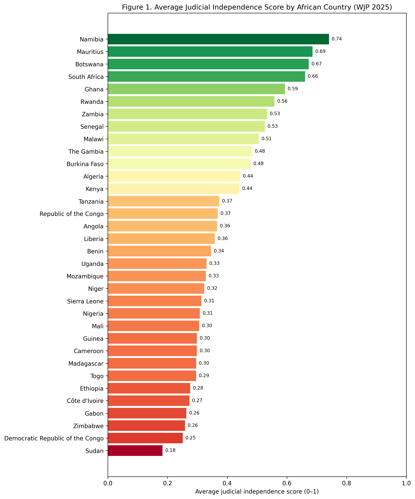

Research Topic
Judicial Independence in Africa
File Naming Convention 
judicial-independence-africa.md
Contributor 
Name: Caterina Menghetti / caterinamenghetti-lab
Team: Operations
Date: 2026-07-24
Overview
Judicial independence is guaranteed under the United Nations Basic Principles on the Independence of the Judiciary, which require States to protect the independence of the judiciary through constitutional or legal provisions. The Principles further provide that judges must decide matters impartially, on the basis of facts and in accordance with the law, without restrictions, improper influences, pressures, threats, or interference from any source.
The African Commission on Human and Peoples' Rights recognizes that every person is entitled to a fair and public hearing before a legally constituted, competent, independent and impartial judicial body. Its Principles and Guidelines further provide that judicial independence must be guaranteed by the constitution and laws of the country, respected by public authorities, protected from inappropriate interference, and safeguarded through transparent and accountable judicial appointment procedures.
This research evaluates judicial independence in African countries using the World Justice Project (WJP) Rule of Law Index 2025. The analysis is based on WJP indicators that assess judicial constraints on government powers, the absence of corruption in the judiciary, and the independence of civil and criminal justice systems from improper government influence. These indicators provide a comparative basis for assessing judicial independence across the continent.
Key Insights
The analysis of the World Justice Project (WJP) Rule of Law Index 2025 reveals substantial variation in judicial independence across African countries included in the Index. Average scores range from 0.25 in the Democratic Republic of the Congo to 0.75 in Rwanda, indicating considerable differences in judicial performance across the continent.
Among the countries assessed, Rwanda (0.75), Namibia (0.74), Botswana (0.72), Mauritius (0.70), and South Africa (0.69) recorded the highest average judicial independence scores. In contrast, the Democratic Republic of the Congo (0.25), Cameroon (0.29), Madagascar (0.30), Mozambique (0.32), and Zimbabwe (0.34) obtained the lowest average scores.
The findings indicate that performance differs considerably across the four indicators used in this research—judicial constraints on government powers, absence of corruption in the judiciary, freedom from improper government influence in civil justice, and freedom from improper government influence in criminal justice—highlighting the multidimensional nature of judicial independence.
Data & Evidence
This research uses quantitative data from the World Justice Project (WJP) Rule of Law Index 2025, one of the most comprehensive global assessments of the rule of law. The Index evaluates the practical application of the rule of law across countries using data collected through nationally representative household surveys and questionnaires completed by legal experts.
Judicial independence was assessed using four indicators from the WJP Rule of Law Index that examine different aspects of the judiciary:
Indicator 1.2 – Government powers are effectively limited by the judiciary;
Indicator 2.2 – Government officials in the judicial branch do not use public office for private gain;
Indicator 7.4 – Civil justice is free of improper government influence;
Indicator 8.6 – Criminal justice is free of improper government influence.¹
For each country included in the analysis, the scores of these four indicators were averaged to produce a single judicial independence score ranging from 0 (weakest performance) to 1 (strongest performance). This approach provides a standardized basis for comparing judicial independence across African countries using a consistent methodology derived from the WJP framework.

The figure highlights substantial disparities in judicial independence across the countries included in the analysis. While Namibia, Mauritius, Botswana, South Africa, and Ghana emerge as the strongest performers, countries such as Sudan, the Democratic Republic of the Congo, Zimbabwe, Togo, and Cameroon record consistently lower scores across the selected indicators. These differences suggest that the strength and effectiveness of judicial institutions vary considerably across the continent.
A broader pattern also emerges from the indicator-level data. In many countries, scores for civil justice free from improper government influence (Indicator 7.4) and criminal justice free from improper government influence (Indicator 8.6) are lower than those for judicial constraints on government powers (Indicator 1.2) and absence of corruption in the judiciary (Indicator 2.2). This indicates that, even where formal guarantees of judicial independence exist, political interference in the administration of justice remains a significant challenge.
These quantitative findings provide a foundation for the next section of the research, which examines documented case studies of judicial interference to better explain the institutional and political factors underlying the observed differences.
Root Causes
Political Interference in Judicial Decision-Making
One of the principal causes of weak judicial independence is political interference in judicial decision-making and judicial careers. Executive or legislative authorities may influence the appointment, promotion, transfer, or disciplinary procedures of judges, reducing the judiciary's ability to act independently. According to the United Nations Special Rapporteur on the Independence of Judges and Lawyers, judicial institutions require effective safeguards against external political pressure to preserve the separation of powers and the rule of law.
Weak Institutional Safeguards
Judicial independence is also undermined where institutional safeguards are weak or insufficiently implemented. Independent judicial councils, transparent appointment procedures, security of tenure, and autonomous judicial administration are essential mechanisms for protecting courts from undue influence. Where these safeguards are absent or ineffective, judicial independence becomes vulnerable to political interference and institutional capture.
Corruption and Integrity Challenges
Corruption and integrity challenges within the judiciary further weaken judicial independence and public confidence in the justice system. The United Nations Special Rapporteur has identified corruption, together with organized crime and other forms of external pressure, as significant contemporary threats to judicial independence, emphasizing that judicial integrity is indispensable for ensuring impartial and effective justice.
Impact
Economic Impact
Weak judicial independence creates legal uncertainty, discourages domestic and foreign investment, weakens contract enforcement, and limits economic development. Effective and independent justice institutions are widely recognized as essential for protecting property rights, fostering business confidence, reducing corruption, and supporting sustainable economic growth.
Social Impact
The absence of an independent judiciary undermines public confidence in the justice system and limits individuals' ability to obtain fair and impartial remedies. This weakens access to justice, exacerbates inequalities, and reduces trust in public institutions, particularly among vulnerable populations.
Political and Governance Impact
Judicial independence is a fundamental component of the rule of law and democratic governance. When courts are unable to operate independently, executive power faces fewer institutional constraints, accountability mechanisms are weakened, and the risk of abuse of power and corruption increases.
Case Studies / Examples
Zimbabwe: Executive Influence over the Judiciary
Zimbabwe has long faced concerns regarding judicial independence, particularly in relation to the influence exercised by the executive over the judiciary. Following the adoption of Constitutional Amendment No. 2 in 2021, the President was granted expanded authority over the appointment of senior judges and the extension of judges' tenure beyond the mandatory retirement age. These reforms generated significant concern among legal practitioners, civil society organizations, and international observers, who argued that they weakened constitutional safeguards designed to preserve judicial autonomy.
The International Commission of Jurists (ICJ) concluded that the amendments increased the risk of political influence over judicial appointments and undermined the separation of powers by reducing institutional checks on executive authority. The Zimbabwean case illustrates how constitutional and legislative reforms can progressively erode judicial independence even where formal judicial institutions remain in place.
Kenya: Judicial Independence and Institutional Resilience
Kenya provides an example of both the importance of judicial independence and the challenges involved in preserving it. In 2017, the Supreme Court made history by annulling the presidential election, citing significant irregularities in the electoral process. The decision represented the first time an African supreme court invalidated the election of an incumbent president and was widely regarded as a landmark demonstration of judicial independence.
However, the ruling was followed by sustained political criticism of the judiciary, budgetary pressures, delays in judicial appointments, and public attacks against judges. According to the International Commission of Jurists, these developments demonstrate that judicial independence requires continuous institutional protection beyond constitutional guarantees alone. While Kenya continues to maintain comparatively stronger judicial institutions than many countries in the region, the experience illustrates how political pressure can threaten judicial autonomy even within relatively well-established constitutional systems.
Existing Solutions / Interventions
Policy Efforts
At the continental and international levels, several legal and policy frameworks have been established to promote judicial independence. The United Nations Basic Principles on the Independence of the Judiciary (1985) define the fundamental standards required to protect judges from improper influence, while the African Charter on Human and Peoples' Rights and the Principles and Guidelines on the Right to a Fair Trial and Legal Assistance in Africa adopted by the African Commission provide regional standards for ensuring independent and impartial judicial systems. Together, these frameworks serve as the normative foundation for judicial reforms across African countries.
Government Programs
Many African countries have introduced judicial reform programmes aimed at strengthening institutional independence, improving judicial administration, increasing transparency, and expanding access to justice. These reforms commonly include the establishment of independent judicial councils, merit-based appointment procedures, judicial training programmes, and the digitalization of court services. Although implementation varies considerably across countries, these initiatives represent important efforts to enhance the efficiency, integrity, and accountability of judicial institutions.
NGO and International Initiatives
International organizations and civil society play an important role in supporting judicial independence through technical assistance, capacity-building, legal monitoring, and advocacy. Organizations such as the International Commission of Jurists (ICJ), the World Justice Project (WJP), and the United Nations Development Programme (UNDP) provide research, policy recommendations, judicial training, and rule of law assessments that assist governments in strengthening judicial institutions and promoting accountability.

Gaps & Opportunities
Weak Implementation of Existing Legal Frameworks
Although comprehensive international and regional standards on judicial independence already exist, implementation remains inconsistent across many African countries. In several jurisdictions, constitutional guarantees are not fully reflected in practice because of political interference, limited institutional capacity, inadequate resources, and weak accountability mechanisms. As a result, the gap lies less in the absence of legal frameworks than in their effective implementation and enforcement.
Strengthening Accountability Through Evidence-Based Monitoring
OpenGov Africa can contribute by supporting evidence-based monitoring of judicial independence and promoting greater institutional accountability. Through research, open data initiatives, policy analysis, and civic engagement, the organization can help identify governance challenges, track reforms, and encourage greater transparency within judicial institutions. Producing accessible research and advocating for evidence-informed policymaking can also strengthen public oversight and support long-term rule of law reforms.
Limited Public Access to Judicial Information
Access to reliable and accessible information on judicial performance remains limited in many African countries. Data on court efficiency, judicial appointments, disciplinary procedures, and institutional performance are often fragmented, difficult to obtain, or unavailable to the public. This reduces transparency and limits citizens' ability to hold judicial institutions accountable.
Expanding Open Justice and Civic Participation
OpenGov Africa is well positioned to promote open justice by improving public access to judicial information and supporting civic participation in governance. Initiatives such as open data platforms, policy briefs, public awareness campaigns, and partnerships with civil society organizations can strengthen transparency while encouraging informed public dialogue on judicial reform and the rule of law.

Sources
African Commission on Human and Peoples' Rights, Principles and Guidelines on the Right to a Fair Trial and Legal Assistance in Africa (2003), Section A.1, Fair and Public Hearing, and Section A.1(n), Independent Tribunal.
Diego García-Sayán, Report of the Special Rapporteur on the Independence of Judges and Lawyers, A/HRC/38/38 (United Nations Human Rights Council, 2 May 2018).
Diego García-Sayán, Report on the UN Basic Principles on the Independence of the Judiciary (United Nations Special Rapporteur on the Independence of Judges and Lawyers, 2019).
International Commission of Jurists (ICJ), Zimbabwe: Constitutional Amendment Undermines Judicial Independence, 25 July 2017; Constitution of Zimbabwe Amendment (No. 2) Act, 2021.
Kenyan Section of the International Commission of Jurists (ICJ Kenya), Submission to the UN Special Rapporteur on the Independence of Judges and Lawyers: Safeguarding the Independence of Judicial Systems in the Face of Contemporary Challenges to Democracy, January 2024.
OECD, Government at a Glance 2023 – Rule of Law.
United Nations, Basic Principles on the Independence of the Judiciary (1985), Principles 1–2.
United Nations Development Programme (UNDP), A Transparent and Accountable Judiciary to Deliver Justice for All (2016).
United Nations Development Programme (UNDP), Strengthening the Rule of Law and Human Rights for Sustainable Peace and Fostering Development (2022).
United Nations Office on Drugs and Crime (UNODC), Guide on Strengthening Judicial Integrity and Capacity (2011).
World Bank, Justice and Development, Global Program on Justice and Rule of Law.
World Justice Project, WJP Rule of Law Index 2025: Country Profiles (Washington, DC: World Justice Project, 2025), including the Methodology and Indicator Framework. Available at: https://worldjusticeproject.org/rule-of-law-index/downloads/WJPIndex2025.pdf

